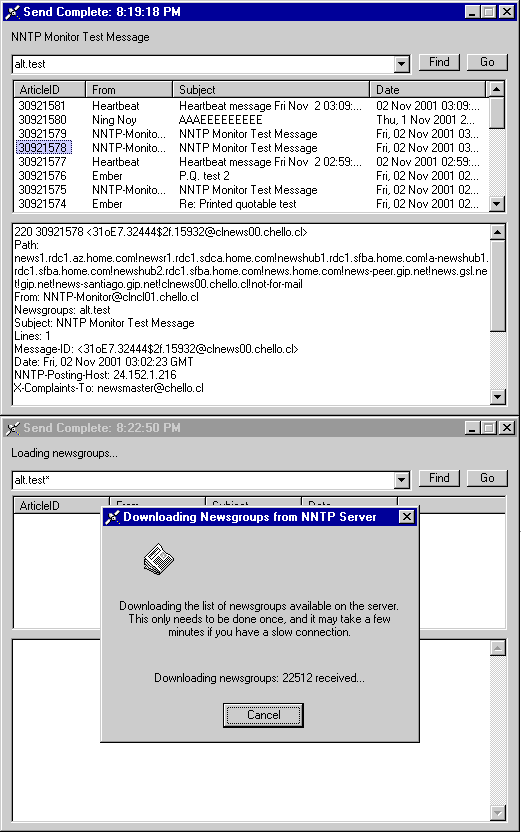



## A real NNTP Newsgroup reader/poster using Winsock with RFC977

### Description

This is a complete NNTP Usenet newsgroup application. It is very basic - not all RFC977 commands have been implemented. This NNTP applications provides a simple news reader (downloads all newsgroups on first run), a simple Usenet message poster, and an automatic poster, to post your *ON TOPIC* messages in up to 10's of thousands of groups in one process! If your NNTP account requires a login username/password, this applications supports it. I threw the app together this evening because I needed something that would submit my advertisement to thousands of *ON TOPIC* newsgroups... it works great for this purpose. I think I will finally be able to sell my car within the next few days!!! joy!
 
### More Info
 

             |
---                |---
**Submitted On**   |2001-11-02 02:24:34
**By**             |[RGSoftware](https://github.com/Planet-Source-Code/PSCIndex/blob/master/ByAuthor/rgsoftware.md)
**Level**          |Advanced
**User Rating**    |4.3 (39 globes from 9 users)
**Compatibility**  |VB 4\.0 \(32\-bit\), VB 5\.0, VB 6\.0
**Category**       |[Complete Applications](https://github.com/Planet-Source-Code/PSCIndex/blob/master/ByCategory/complete-applications__1-27.md)
**World**          |[Visual Basic](https://github.com/Planet-Source-Code/PSCIndex/blob/master/ByWorld/visual-basic.md)
**Archive File**   |[A real NNT327471122001\.zip](https://github.com/Planet-Source-Code/rgsoftware-a-real-nntp-newsgroup-reader-poster-using-winsock-with-rfc977__1-28584/archive/master.zip)

